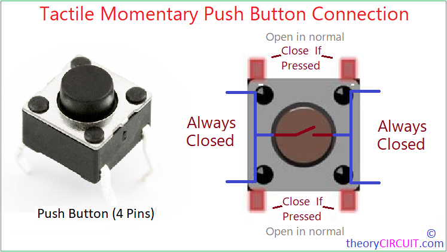

# Session 01: Introduction to Arduino

1. Introductions

2. Course overview

3. What is GitHub?

4. Hands-on with Arduino
    + Overview
    + Basic wiring and electronics
    + Basic programming: flow, variables, constants, etc.

## Arduino and Electronics

What is electricity?


What is Arduino?


Pins, voltage, power, etc.

## Start with the classic output: blinking an LED

```c
// Example 01: Blinking LED
const int LED = 13;  // LED connected to digital pin 13

void setup() {
  pinMode(LED, OUTPUT);  // sets the digital pin as output
}

void loop() {
  digitalWrite(LED, HIGH);  // turns the LED on
  delay(1000);              // waits for a second
  digitalWrite(LED, LOW);   // turns the LED off
  delay(1000);              // waits for a second
}
```

## Classic input: button



The Floating State

A digital input pin on an Arduino is extremely sensitive. It acts like a tiny antenna.

+ If you connect a pin to 5V, it reads HIGH.

+ If you connect it to GND, it reads LOW.

+ If you connect it to nothing (an open switch), it is "Floating."

In a floating state, the pin will pick up electromagnetic interference from the air, nearby wires, or even your hand. The Arduino will rapidly flip between 0 and 1 randomly. A resistor is used to "tie" the pin to a known state when the button is not pressed.

### Using an External Pull-Down Resistor


This is the most intuitive way to wire a button for beginners: the button "pulses" the signal to HIGH when pressed.
The Wiring

    Connect one side of the button to 5V.

    Connect the other side of the button to your Digital Pin (e.g., Pin 2).

    Connect a 10kΩ resistor from that same Digital Pin to GND.

How it Works

    Button Open (Not Pressed): The Digital Pin is connected to GND through the resistor. The resistor "pulls" the voltage down to 0V. The Arduino reads LOW.

    Button Closed (Pressed): There is now a direct, low-resistance path from 5V to the Digital Pin. The 5V "overpowers" the GND connection. The Arduino reads HIGH.

### Using an Internal Pull-Up Resistor


This method uses the Arduino's built-in pull-up resistor, eliminating the need for an external resistor. The button "pulls" the signal to LOW when pressed.

The Wiring

    Connect one side of the button to your Digital Pin (e.g., Pin 2).

    Connect the other side of the button to GND.

    Enable the internal pull-up in your code using `pinMode(PIN, INPUT_PULLUP);`.

How it Works

    Button Open (Not Pressed): The internal pull-up resistor "pulls" the voltage up to 5V. The Arduino reads HIGH.

    Button Closed (Pressed): There is now a direct, low-resistance path from the Digital Pin to GND. The connection to ground has no resistance, making it the path the electricity travels through. The Arduino reads LOW.
