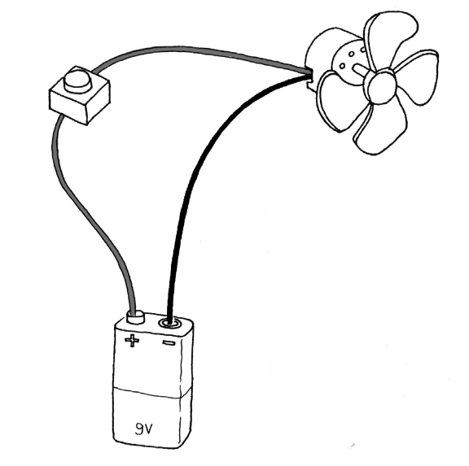
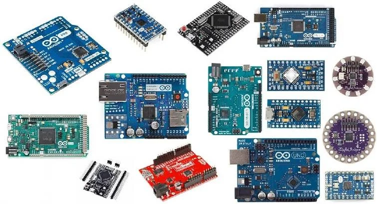

# Session 01: Introduction to Arduino

## Before we do anything

[Download Arduino](https://www.arduino.cc/en/software/)

## Agenda

1. Introductions
2. Course overview
3. What is GitHub?
4. Hands-on with Arduino
    * Overview
    * Basic wiring and electronics
    * Basic programming: flow, variables, constants, comments, etc.

---

## Arduino and Electronics

### What is electricity?

<p>
  
  <br>
  <em>How electricity flows in circuits</em>
</p>

### What is Arduino?

<p>
  
  <br>
  <em>Different Arduino board models</em>
</p>

Pins, voltage, power, etc.

## Start with the classic output: blinking an LED

```cpp
// Example 01: Blinking LED
const int LED = 13;  // LED connected to digital pin 13

void setup() {
  pinMode(LED, OUTPUT);  // sets the digital pin as output
}

void loop() {
  digitalWrite(LED, HIGH);  // turns the LED on
  delay(1000);              // waits for a second
  digitalWrite(LED, LOW);   // turns the LED off
  delay(1000);              // waits for a second
}
```

But wait, pin 13? What about other pins... and what about resistors?

<p>
  
  <br>
  <em>Arduino wired to an LED on a breadboard</em>
</p>

LEDs are greedy. Unlike a resistor or a motor, an LED has almost no internal resistance once it starts conducting. It will try to pull as much current as the power supply can provide until it literally burns itself out. Think of the LED like a water wheel below a waterfall. Too much water will break the wheel, but it still needs enough to activate. A resistor basically "wastes" some of the voltage supplied to the LED circuit by converting it to heat. In short: if we don't use a resistor in series with the LED, the LED will burn out quickly. Fun fact: it does not matter whether the LED is "in front" or "behind" the resistor, it only matters that resistance is introduced into the circuit.

### Experiment

Make some changes to personalize the sketch and learn-by-doing. I learned to program by downloading source code and changing things one at a time until I understood what each part did. Some ideas for this sketch:

* Change the delay by substituting the number `1000` (technically referred to as a numeric literal) for a variable.
* Rather than an on/off repeated pattern, how might you make this more complicated? (Bonus: [Random function](https://docs.arduino.cc/language-reference/en/functions/random-numbers/random/))
* Make the sketch blink 2 or 3 LEDs.

[Tinkercad Circuits example of 2 LED circuit](https://www.tinkercad.com/things/iCUMhBSbCGF-simple-2-led-circuit)

## Links to review this content

* [Blink an LED with Arduino](https://docs.arduino.cc/built-in-examples/basics/Blink/)
