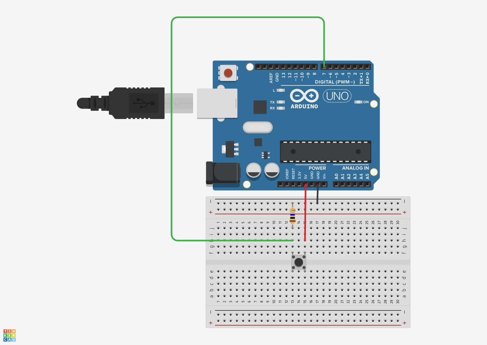
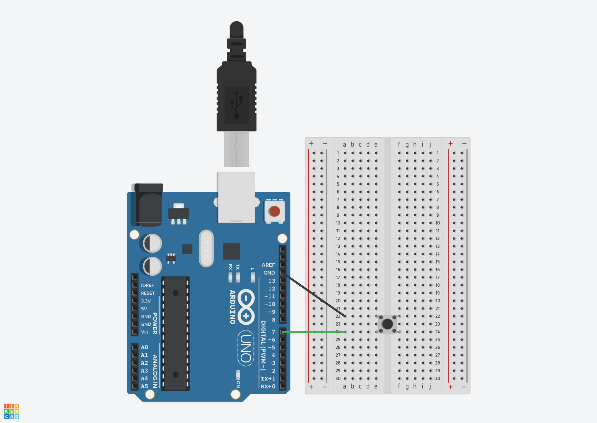

# Session 02: Inputs and Serial Communication

## Agenda

+ Conditional logic
+ Input (button circuit)
+ Serial communication

## Serial Communication

Serial communication is an incredible tool. Since the Arduino is an "opaque" hardware system, Serial is our way to look under the hood. We can use it to show the values of variables and diagnose problems that are otherwise elusive.

<p>
  
  <br>
  <em>Serial communication between Arduino and computer</em>
</p>

```cpp
void setup()                      // run once, when the sketch starts
{
    Serial.begin(9600);           // set up Serial library at 9600 bps
}

void loop()                       // run over and over again
{
    Serial.println("Hello world!");  // prints hello with ending line break
    delay(1000);
}
```

### Experiment

* Try it with `print` instead of `println`.

## Classic input: button

<p>
  
  <br>
  <em>Push button component</em>
</p>

### The Floating State

A digital input pin on an Arduino is extremely sensitive. It acts like a tiny antenna.

* If you connect a pin to 5V, it reads `HIGH`.
* If you connect it to GND, it reads `LOW`.
* If you connect it to nothing (an open switch), it is "Floating."

In a floating state, the pin will pick up electromagnetic interference from the air, nearby wires, or even your hand. The Arduino will rapidly flip between 0 and 1 randomly. A resistor is used to "tie" the pin to a known state when the button is not pressed.

### Using an External Pull-Down Resistor

<p>
  
  <br>
  <em>Button circuit with external pull-down resistor</em> <a href="https://www.tinkercad.com/things/jcplrXYEhUa-arduino-pulldown-button-circuit?sharecode=IzvD_H15lnABZCZ2j2yh9VKLpoTXc9dBGmMz7jC2Ow4">Tinkercad Circuit</a>
</p>

This is the most intuitive way to wire a button for beginners: the button "pulses" the signal to `HIGH` when pressed.

#### The Wiring

* Connect one side of the button to **5V**.
* Connect the other side of the button to your **Digital Pin** (e.g., Pin 7).
* Connect a **10kΩ resistor** from that same Digital Pin to **GND**.

#### How it Works

* **Button Open (Not Pressed):** The Digital Pin is connected to GND through the resistor. The resistor "pulls" the voltage down to 0V. The Arduino reads `LOW`.
* **Button Closed (Pressed):** There is now a direct, low-resistance path from 5V to the Digital Pin. The 5V "overpowers" the GND connection. The Arduino reads `HIGH`.

```cpp
const int BUTTON = 7;  // button connected to digital pin 7
const int LED = 13;    // LED connected to digital pin 13

void setup() {
  pinMode(BUTTON, INPUT);   // set button pin as input
  pinMode(LED, OUTPUT);     // set LED pin as output
}

void loop() {
  int buttonState = digitalRead(BUTTON);  // read button state
  
  if (buttonState == HIGH) {  // button pressed (pulled HIGH by 5V)
    digitalWrite(LED, HIGH);   // turn LED on
  } else {                     // button not pressed
    digitalWrite(LED, LOW);    // turn LED off
  }
}
```

#### Experiment

Make a "button circuit" without a button.

### Using an Internal Pull-Up Resistor

<p>
  
  <br>
  <em>Button circuit with internal pull-up resistor</em> <a href="https://www.tinkercad.com/things/7B3QpxUSUb0-arduino-internal-pullup-button-circuit?sharecode=cQjVWPQ1o5n4zr0krJd_GhEf2hvhcsabkXQRBKI5UdU">Tinkercad Circuit</a>
</p>

This method uses the Arduino's built-in pull-up resistor, eliminating the need for an external resistor. The button "pulls" the signal to `LOW` when pressed.

#### The Wiring

* Connect one side of the button to your **Digital Pin** (e.g., Pin 7).
* Connect the other side of the button to **GND**.
* Enable the internal pull-up in your code using `pinMode(PIN, INPUT_PULLUP);`.


#### How it Works

* **Button Open (Not Pressed):** The internal pull-up resistor "pulls" the voltage up to 5V. The Arduino reads `HIGH`.
* **Button Closed (Pressed):** There is now a direct, low-resistance path from the Digital Pin to GND. The connection to ground has no resistance, making it the path the electricity travels through. The Arduino reads `LOW`.

```cpp
const int BUTTON = 7;  // button connected to digital pin 7
const int LED = 13;    // LED connected to digital pin 13

void setup() {
  pinMode(BUTTON, INPUT_PULLUP);  // set button pin with internal pull-up
  pinMode(LED, OUTPUT);           // set LED pin as output
}

void loop() {
  int buttonState = digitalRead(BUTTON);  // read button state
  
  if (buttonState == LOW) {   // button pressed (pulled LOW by GND)
    digitalWrite(LED, HIGH);   // turn LED on
  } else {                    // button not pressed
    digitalWrite(LED, LOW);   // turn LED off
  }
}
```

## Links to review this content

* [Arduino button tutorial with a pulldown resistor](https://docs.arduino.cc/built-in-examples/digital/Button/)
* [Arduino button tutorial with a pullup resistor](https://docs.arduino.cc/tutorials/generic/digital-input-pullup/)
* [In-depth Serial tutorial from the legendary Lady Ada](https://www.ladyada.net/learn/arduino/lesson4.html)
