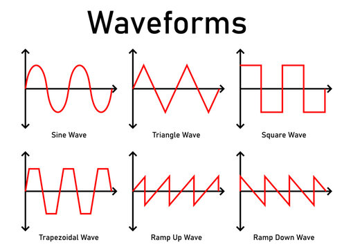

# Session 03: Sound and Square Waves

In this session, we will explore how to generate sound using an Arduino. We will start by manipulating a piezoelectric buzzer directly with `digitalWrite()` to understand the fundamental concept of sound as a vibration over time.

## How Speakers Work (Simplified)

A speaker or buzzer works by vibrating a diaphragm (a thin membrane) back and forth. These vibrations compress and decompress the air, creating sound waves that travel to our ears.

*   **HIGH (5V):** The diaphragm pushes out.
*   **LOW (0V):** The diaphragm pulls back in.

If we switch between HIGH and LOW fast enough, the diaphragm vibrates, and we hear a tone.

## Generating a Square Wave

A "square wave" is the simplest type of sound wave to generate with digital electronics. It gets its name from looking like a series of square pulses on a graph, rather than a smooth sine wave.

<p>
  
  <br>
  <em>Visualization of a square wave</em>
</p>

To create a tone, we need to:
1.  Turn the pin HIGH.
2.  Wait for a tiny amount of time.
3.  Turn the pin LOW.
4.  Wait for the same amount of time.
5.  Repeat.

The **pitch** (high or low note) depends on how fast we repeat this cycle (frequency).
The **duration** depends on how many times we repeat the cycle.

### Manual Tone Generator

Connect a piezo buzzer or small speaker:
*   Positive leg (+) to **Pin 8**.
*   Negative leg (-) to **GND**.

```arduino
const int SPEAKER_PIN = 8;

void setup() {
  pinMode(SPEAKER_PIN, OUTPUT);
}

void loop() {
  // Create a 1 kHz tone (1000 cycles per second)
  // Period = 1 second / 1000 = 1000 microseconds
  // Half-period (high time) = 500 microseconds
  
  digitalWrite(SPEAKER_PIN, HIGH);
  delayMicroseconds(500); // Wait 500 microseconds
  digitalWrite(SPEAKER_PIN, LOW);
  delayMicroseconds(500); // Wait 500 microseconds
}
```

*Note: We use `delayMicroseconds()` instead of `delay()` because sound vibrations are very fast. `delay(1)` (1 millisecond) would produce a 500Hz tone, which is a relatively low pitch.*

### Experiment: Making a Siren

By changing the delay time inside the loop, we can change the pitch.

```arduino
const int SPEAKER_PIN = 8;

void setup() {
  pinMode(SPEAKER_PIN, OUTPUT);
}

void loop() {
  // Rising tone
  for (int i = 1000; i > 200; i--) {
    digitalWrite(SPEAKER_PIN, HIGH);
    delayMicroseconds(i);
    digitalWrite(SPEAKER_PIN, LOW);
    delayMicroseconds(i);
  }
  
  // Falling tone
  for (int i = 200; i < 1000; i++) {
    digitalWrite(SPEAKER_PIN, HIGH);
    delayMicroseconds(i);
    digitalWrite(SPEAKER_PIN, LOW);
    delayMicroseconds(i);
  }
}
```

## The Easy Way: `tone()`

While manual manipulation helps us understand the physics, Arduino provides a built-in function to do this for us in the background.

*   `tone(pin, frequency)`: Starts playing a square wave of the specified frequency.
*   `tone(pin, frequency, duration)`: Plays the tone for a specific duration (in milliseconds).
*   `noTone(pin)`: Stops the tone.

### Playing a Melody

```arduino
const int SPEAKER_PIN = 8;

// Note frequencies (in Hz)
const int NOTE_C4 = 262;
const int NOTE_D4 = 294;
const int NOTE_E4 = 330;
const int NOTE_F4 = 349;
const int NOTE_G4 = 392;
const int NOTE_A4 = 440;
const int NOTE_B4 = 494;
const int NOTE_C5 = 523;

void setup() {
  pinMode(SPEAKER_PIN, OUTPUT);
  
  // Play a simple scale
  tone(SPEAKER_PIN, NOTE_C4, 200); 
  delay(250); // wait slightly longer than note duration to separate notes
  tone(SPEAKER_PIN, NOTE_D4, 200);
  delay(250);
  tone(SPEAKER_PIN, NOTE_E4, 200);
  delay(250);
  tone(SPEAKER_PIN, NOTE_F4, 200);
  delay(250);
  tone(SPEAKER_PIN, NOTE_G4, 200);
  delay(250);
  
  noTone(SPEAKER_PIN); // Stop sound if not using duration
}

void loop() {
  // Nothing here, runs once
}
```

## Challenge

Combine what we learned in Session 02 (Buttons) with Session 03 (Sound). Create a "keyboard" where pressing a button plays a specific note.

**Bonus:** Can you make the pitch change based on a potentiometer (knob)? (Hint: Look up `analogRead()` and `map()`).
