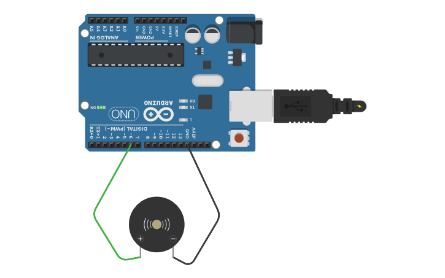

# Session 03: Sound and Square Waves

In this session, we will explore how to generate sound using an Arduino. We will start by manipulating a piezoelectric buzzer directly with `digitalWrite()` to understand the fundamental concept of sound as a vibration over time.

## Agenda

+ Introduction to sound
+ Generating tones with `digitalWrite()`
+ Using the `tone()` function

## How Speakers Work (Simplified)

A speaker or buzzer works by vibrating a diaphragm (a thin membrane) back and forth. These vibrations compress and decompress the air, creating sound waves that travel to our ears.

*   **HIGH (5V):** The diaphragm pushes out.
*   **LOW (0V):** The diaphragm pulls back in.

If we switch between HIGH and LOW fast enough, the diaphragm vibrates, and we hear a tone.

## Generating a Square Wave

A "square wave" is the simplest type of sound wave to generate with digital electronics. It gets its name from looking like a series of square pulses on a graph, rather than a smooth sine wave.

<p>
  
  <br>
  <em>Visualization of different wave forms</em>
</p>

To create a tone, we need to:
1.  Turn the pin HIGH.
2.  Wait for a tiny amount of time.
3.  Turn the pin LOW.
4.  Wait for the same amount of time.
5.  Repeat.

The **pitch** (high or low note) depends on how fast we repeat this cycle (frequency).
The **duration** depends on how many times we repeat the cycle.

<p>
  
  <br>
  <em>Arduino speaker circuit</em> <a href="https://www.tinkercad.com/things/fosHSFB6Ahh-simple-arduino-sound-circuit?sharecode=wD2p0_hYTjGaWhUoyKmZzskugx5eNmapXuxfyn0w9hc">Tinkercad Circuit</a>
</p>

### Code Example: Manual Tone Generator

This code generates a continuous tone by rapidly switching a digital pin HIGH and LOW. The `loop()` function constantly repeats, creating a square wave that we can hear.

Connect a piezo buzzer or small speaker:
*   Positive leg (+) to **Pin 8**.
*   Negative leg (-) to **GND**.

```cpp
// This constant holds the pin number for our speaker.
// Using a constant makes the code easier to read and modify.
const int SPEAKER_PIN = 8;

// The setup function runs once when the Arduino is powered on or reset.
void setup() {
  // We set the speaker pin as an OUTPUT because we are sending signals to it.
  pinMode(SPEAKER_PIN, OUTPUT);
}

// The loop function runs continuously after setup() has finished.
void loop() {
  // To create a tone, we need to turn the speaker on and off very quickly.
  // This on-off cycle is called a square wave.
  
  // The "period" of a wave is the time for one full cycle.
  // For a 1kHz tone (1000 cycles per second), the period is 1/1000 of a second,
  // which is 1000 microseconds.
  // We divide this by two for the HIGH part and the LOW part of the wave.
  int halfPeriod = 500; // in microseconds

  // 1. Set the pin to HIGH (5V), pushing the speaker diaphragm out.
  digitalWrite(SPEAKER_PIN, HIGH);
  
  // 2. Wait for half of the period.
  // We use delayMicroseconds() for the precise, short delays needed for audio frequencies.
  delayMicroseconds(halfPeriod); 
  
  // 3. Set the pin to LOW (0V), pulling the speaker diaphragm back in.
  digitalWrite(SPEAKER_PIN, LOW);
  
  // 4. Wait for the other half of the period to complete the cycle.
  delayMicroseconds(halfPeriod);
  
  // The loop() function immediately repeats, creating a continuous 1kHz tone.
}
```

*Note: We use `delayMicroseconds()` instead of `delay()` because sound vibrations are very fast. `delay(1)` (1 millisecond) would produce a 500Hz tone, which is a relatively low pitch.*


## The Easy Way: `tone()`

While manual manipulation helps us understand the physics, Arduino provides a built-in function to do this for us in the background. This is much more convenient for playing melodies.

*   `tone(pin, frequency)`: Starts playing a square wave of the specified frequency on a pin. The sound will continue forever until you stop it.
*   `tone(pin, frequency, duration)`: Plays the tone for a specific duration (in milliseconds). The Arduino will pause other code while the note plays.
*   `noTone(pin)`: Stops the tone currently playing on a pin.

### Code Example: Playing a Melody with `tone()`

This example shows how to use the `tone()` function to play the first few notes of a major scale. Because this code is in `setup()`, it will only play once.

```cpp
// This constant holds the pin number for our speaker.
const int SPEAKER_PIN = 8;

// Define the frequencies (in Hertz) for musical notes.
// These are standard values for the 4th octave (the one in the middle of a piano).
const int NOTE_C4 = 262;
const int NOTE_D4 = 294;
const int NOTE_E4 = 330;
const int NOTE_F4 = 349;
const int NOTE_G4 = 392;

// The setup function runs once when the Arduino is powered on or reset.
void setup() {
  // We don't need pinMode() for the speaker pin when using tone().
  // The tone() function handles it for us.

  // The `tone(pin, frequency, duration)` function plays a note and waits.
  // However, to create a clear separation between notes, it's better to
  // control the timing ourselves with `delay()`.
  
  // Play note C4 for 200 milliseconds
  tone(SPEAKER_PIN, NOTE_C4, 200); 
  delay(250); // Wait for 250ms. This creates a 50ms pause before the next note.
  
  // Play note D4 for 200 milliseconds
  tone(SPEAKER_PIN, NOTE_D4, 200);
  delay(250);
  
  // Play note E4 for 200 milliseconds
  tone(SPEAKER_PIN, NOTE_E4, 200);
  delay(250);
  
  // Play note F4 for 200 milliseconds
  tone(SPEAKER_PIN, NOTE_F4, 200);
  delay(250);
  
  // Play note G4 for 200 milliseconds
  tone(SPEAKER_PIN, NOTE_G4, 200);
  delay(250);
  
  // It's good practice to stop the tone, although with a duration specified,
  // it would stop on its own.
  noTone(SPEAKER_PIN);
}

// The loop() function is empty because we only want the melody to play once at the start.
void loop() {
  // Nothing here.
}
```

## Challenge

Combine what we learned in Session 02 (Buttons) with Session 03 (Sound). Create a "keyboard" where pressing a button plays a specific note.

**Bonus:** Can you make the pitch change based on a potentiometer (knob)? (Hint: Look up `analogRead()` and `map()`).

## In class examples
This example creates a simple siren-like sound that sweeps down in pitch, then resets. It uses a global variable `section` to control which part of the sound is playing. This demonstrates how to create a sequence of actions without using loops, relying on the main `loop()` to repeat and check the state.

```cpp
// The pin connected to the speaker.
int speakerPin = 7;

// This variable will hold the delay time in microseconds.
// A smaller value creates a higher pitch, a larger value creates a lower pitch.
// We start with a high pitch (short delay).
int speakerPeriod = 500;

// This variable acts as a "state" to remember which part of the siren we are playing.
// 0 = first descending tone
// 1 = second, faster descending tone
int section = 0;


// The setup function runs once at the start.
void setup()
{
  // Set the speaker pin to be an output.
  pinMode(speakerPin, OUTPUT);
}

// The loop function runs continuously.
void loop()
{
  // Check if we are in the first section of the siren.
  if(section == 0) {
    // Generate one cycle of the square wave.
    digitalWrite(speakerPin, HIGH);
    delayMicroseconds(speakerPeriod);
    digitalWrite(speakerPin, LOW);
    delayMicroseconds(speakerPeriod);

    // Increase the period slightly, which lowers the pitch.
    speakerPeriod = speakerPeriod + 10;

    // Check if the pitch has become low enough (period is long enough).
    if(speakerPeriod >= 1500) {
      // Reset the period to a high pitch for the next section.
      speakerPeriod = 500;
      
      // Change the state to the second section.
      section = 1;
      
      // A short pause before the next section begins.
      delay(100);
    }
  }
  
  // Check if we are in the second section of the siren.
  if(section == 1) {
    // Generate one cycle of the square wave.
    digitalWrite(speakerPin, HIGH);
    delayMicroseconds(speakerPeriod);
    digitalWrite(speakerPin, LOW);
    delayMicroseconds(speakerPeriod);

    // Increase the period by a larger amount, making the pitch drop faster.
    speakerPeriod = speakerPeriod + 50;

    // Check if the pitch has become low enough.
    if(speakerPeriod >= 2500) {
      
      // Reset the period back to the starting high pitch.
      speakerPeriod = 500;
      
      // Change the state back to the first section.
      section = 0;
      
      // A short pause before the whole pattern repeats.
      delay(100);
    }
  }
}
```