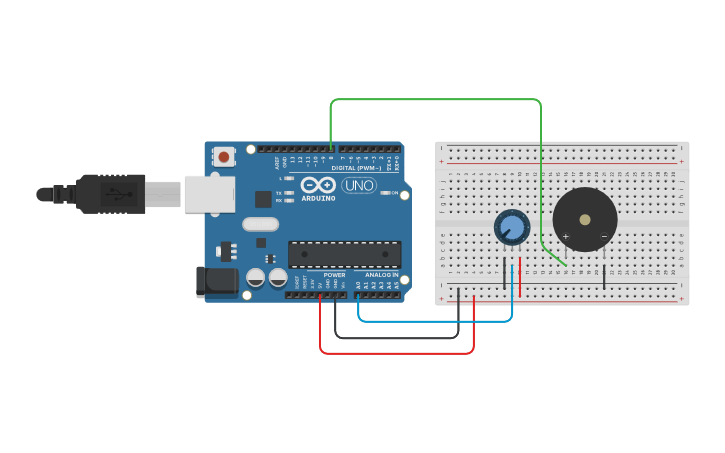

# Session 04: Analog Input and Loops

In this session, we'll bridge the gap between the digital and analog worlds. We'll learn how to read variable inputs from a potentiometer and how to use loops to create repetitive actions like fading lights or warbling sirens. Finally, we'll combine these ideas with buttons to create an interactive musical instrument.

## Agenda

+ Reading analog values with `analogRead()`
+ Mapping values with the `map()` function
+ Creating repetition with `while` loops
+ Project: Building a button-based keyboard

---

## Part 1: Analog Input with a Potentiometer

So far, we've only used `digitalRead()` and `digitalWrite()`, which are limited to two states: HIGH and LOW. The real world is rarely that simple. An **analog** signal can be any value within a range. A potentiometer (or "pot") is a knob that provides a variable resistance, which we can read as an analog voltage.

To read this, we use the analog input pins (A0, A1, A2, etc.) and the `analogRead()` function.

*   `analogRead(pin)`: Reads the voltage on an analog pin and returns a number between **0** (for 0 volts) and **1023** (for 5 volts).

### Example 1: Reading the Potentiometer

Let's start with the simplest possible example: reading the value from the potentiometer and printing it to the Serial Monitor so we can see what the Arduino is sensing.

#### Circuit: Potentiometer for Serial Output

1.  **Potentiometer:**
    *   Connect the two outer pins to 5V and GND.
    *   Connect the middle pin to Analog Pin **A0**.

#### Code: Printing Analog Values

This code initializes serial communication and, in the main loop, continuously reads the analog value from pin A0 and prints it to the Serial Monitor.

```cpp
// Analog pin connected to the potentiometer's middle leg
const int POT_PIN = A0;

void setup() {
  // Initialize Serial communication at 9600 bits per second.
  // This allows the Arduino to send data to the computer.
  Serial.begin(9600);
}

void loop() {
  // 1. Read the raw analog value from the potentiometer.
  // This will be a number between 0 and 1023.
  int potValue = analogRead(POT_PIN);

  // 2. Print the value to the Serial Monitor.
  // Open the Serial Monitor in the Arduino IDE (Tools > Serial Monitor) to see the output.
  Serial.println(potValue);
  
  // Wait for 100 milliseconds before the next reading.
  // This slows down the printing so we can read it easily.
  delay(100); 
}
```
*After uploading this code, open the Serial Monitor and turn the knob. You should see the numbers change from 0 to 1023.*

---

### Example 2: Controlling Pitch with a Knob

Now let's use that value to do something more interesting, like controlling sound. This code reads the value from the potentiometer and uses it to control the pitch of the sound. A raw value of 0-1023 is not a good range for frequencies, so we use the `map()` function to scale it.

`map(value, fromLow, fromHigh, toLow, toHigh)` is a super useful function that re-maps a number from one range to another.

#### Circuit: Potentiometer and Speaker

<p>
  
  <br>
  <em><a href="https://www.tinkercad.com/things/6f2VjdGorU9-mighty-snaget-vihelmo">Tinkercad Circuit</a></em>
</p>

1.  **Speaker:** Positive leg to Pin 8, Negative leg to GND.
2.  **Potentiometer:** Connect middle pin to **A0**, and outer pins to 5V and GND.


#### Code: Potentiometer-controlled Pitch

```cpp
// Pin connected to the speaker
const int SPEAKER_PIN = 8;
// Analog pin connected to the potentiometer's middle leg
const int POT_PIN = A0;

void setup() {
  // No pinMode is needed for analog inputs.
  // The tone() function handles the speaker pin setup.
}

void loop() {
  // 1. Read the raw analog value from the potentiometer.
  int potValue = analogRead(POT_PIN);

  // 2. Map the potentiometer's range (0-1023) to a musical frequency range.
  // Let's choose a range from a low note (120Hz) to a high note (1500Hz).
  int frequency = map(potValue, 0, 1023, 120, 1500);

  // 3. Play the calculated frequency on the speaker.
  // This will play continuously, but the loop will update the frequency so fast
  // it sounds like the pitch is changing instantly.
  tone(SPEAKER_PIN, frequency);
  
  // A small delay can sometimes help stabilize the readings, but is often not needed.
  delay(10); 
}
```

---

## Part 2: `while` Loops

A `while` loop is a code structure that repeats a block of code **as long as** a certain condition is true. This is useful for creating sequences that need to run to completion before the main `loop()` continues.

The structure is:
```cpp
while (condition) {
  // ... this code repeats as long as condition is true
}
```

### The Concept of "Blocking" Code
This is a very important concept. Code that is **blocking** "blocks" or pauses the entire program until it's finished. 

The most common blocking function we use is `delay()`. When your program reaches `delay(1000)`, it stops dead in its tracks for one full second. It cannot read sensors, check buttons, or do anything else until that second is over.

`while` loops can also be a form of blocking code. In the examples below, the `while` loop will capture the program's full attention until its condition is no longer true. This is useful for simple, dedicated actions, but it makes it very difficult to do two things at once. This is why the "state machine" technique we saw in Session 03 (using variables to remember a "state" in the main loop) is so powerful for more advanced projects.

### `while` Loop Example: Fading an LED

This code uses a `while` loop to make an LED smoothly fade in and out. The `loop()` function will be stuck inside the first `while` loop until the fade-in is complete, and then it will be stuck inside the second one until the fade-out is complete.

**Circuit:** Connect an LED (with a 220-ohm resistor) to Pin 9.

```cpp
const int LED_PIN = 9; // Must be a PWM pin (~)

void setup() {
  pinMode(LED_PIN, OUTPUT);
}

void loop() {
  // --- Fade In (This is a blocking loop) ---
  int brightness = 0;
  while (brightness <= 255) {
    analogWrite(LED_PIN, brightness);
    brightness = brightness + 5; // Increase brightness
    delay(30); // This delay is what makes the loop take time
  }

  // --- Fade Out (This is also a blocking loop) ---
  brightness = 255;
  while (brightness >= 0) {
    analogWrite(LED_PIN, brightness);
    brightness = brightness - 5; // Decrease brightness
    delay(30); // Program is paused here on each step
  }
}
```
*Warning: `while` loops can be dangerous! If the condition inside the `while()` parentheses never becomes false, your program will be stuck in the loop forever and will become unresponsive. Notice how we change the `brightness` variable inside the loop so it eventually ends.*


### `while` Loop Example: A Blocking Siren

Here is the siren example, implemented with blocking `while` loops. The rising tone must finish completely before the falling tone can begin. While the siren is rising, the Arduino cannot do anything else (like check for a button press).

```cpp
const int SPEAKER_PIN = 8;

void setup() {
  pinMode(SPEAKER_PIN, OUTPUT);
}

void loop() {
  // --- Rising Tone ---
  // Start with a low pitch (long period) and go to a high pitch (short period).
  int period = 1000;
  while (period > 200) {
    // This inner code is our manual, blocking way of making a tone
    digitalWrite(SPEAKER_PIN, HIGH);
    delayMicroseconds(period);
    digitalWrite(SPEAKER_PIN, LOW);
    delayMicroseconds(period);
    
    // Make the pitch higher for the next loop run
    period = period - 5;
  }
  
  // --- Falling Tone ---
  // Start with a high pitch and go to a low pitch.
  period = 200;
  while (period < 1000) {
    digitalWrite(SPEAKER_PIN, HIGH);
    delayMicroseconds(period);
    digitalWrite(SPEAKER_PIN, LOW);
    delayMicroseconds(period);

    // Make the pitch lower for the next loop run
    period = period + 5;
  }
}
```

---

## Part 3: Project: A Musical Keyboard

Let's combine what we know about buttons (`digitalRead`) and sound (`tone`) to create a simple musical keyboard. Each button will play a different note.

### Circuit: Three-Button Keyboard

1.  **Speaker:** Positive leg to Pin 8, Negative leg to GND.
2.  **Buttons:**
    *   Connect one side of each button to Pin 2, 3, and 4 respectively.
    *   Connect the other side of each button to GND.
    *   We will use the `INPUT_PULLUP` mode, so no external resistors are needed!

### Code: Button Keyboard

This code checks each button. If a button is pressed, it plays the corresponding note. If no buttons are pressed, it turns the sound off with `noTone()`.

```cpp
// Speaker Pin
const int SPEAKER_PIN = 8;

// Button Pins
const int BUTTON1_PIN = 2;
const int BUTTON2_PIN = 3;
const int BUTTON3_PIN = 4;

// Note Frequencies (in Hz)
const int NOTE_C4 = 262;
const int NOTE_D4 = 294;
const int NOTE_E4 = 330;

void setup() {
  // Set up the button pins with the internal pull-up resistor.
  // This means the pin will be HIGH when the button is NOT pressed,
  // and LOW when it IS pressed.
  pinMode(BUTTON1_PIN, INPUT_PULLUP);
  pinMode(BUTTON2_PIN, INPUT_PULLUP);
  pinMode(BUTTON3_PIN, INPUT_PULLUP);
}

void loop() {
  // Check the state of the first button.
  // Because we are using INPUT_PULLUP, a pressed button is LOW.
  if (digitalRead(BUTTON1_PIN) == LOW) {
    tone(SPEAKER_PIN, NOTE_C4); // Play note C4

  } else if (digitalRead(BUTTON2_PIN) == LOW) {
    tone(SPEAKER_PIN, NOTE_D4); // Play note D4

  } else if (digitalRead(BUTTON3_PIN) == LOW) {
    tone(SPEAKER_PIN, NOTE_E4); // Play note E4
    
  } else {
    // If no buttons are being pressed, turn the speaker off.
    noTone(SPEAKER_PIN);
  }
}
```

### Why can't I play two notes at once?

This is a very common and insightful question. With the code above, if you press two buttons at once, you will only hear one note. Why?

1.  **Sequential Code:** The `if...else if...` structure is sequential. The Arduino checks the first button. If it's pressed, it plays that note and *skips checking the rest of the buttons*. It can only ever be inside one of the `if` blocks at a time.
2.  **Hardware Limitations:** The `tone()` function uses one of the Arduino's hardware timers to generate a frequency. This hardware can only be set to one frequency at a time. It's like a radio that can only be tuned to one station at a time.

Playing multiple notes (polyphony) is more complicated because you can't use the simple `tone()` function or blocking code. It requires a non-blocking approach where you manually control the speaker's vibrations for all the notes you want to play, which is a more advanced topic.