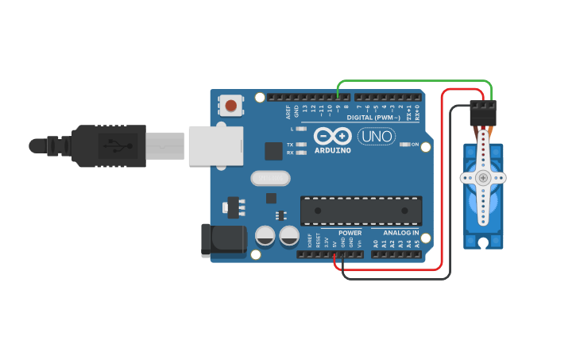

# Session 05: Sensors, Motors, and Introduction to Processing

Today we make things move. Servo motors let the Arduino rotate to a specific angle on command, which means we can build actual mechanisms. We'll wire up a servo, control it with a pot, then build a two-joint robot arm.

## Agenda

+ Introduction to servo motors and the `Servo` library
+ Controlling a servo with a potentiometer
+ Project: Building a 2-DOF robot arm


## Part 1: Servo Motors

A servo motor is a special kind of motor that can be told to move to a specific angle (usually between 0° and 180°). Inside, it has a small DC motor, a set of gears, and a position sensor. You send it a signal, and it moves to that position and holds there. This makes servos perfect for things like robot arms, steering mechanisms, and animatronics.

<p>
  
  <br>
  <em>Inside a servo motor: DC motor, gears, and a position feedback sensor</em>
</p>

### Wiring a Servo

Servo motors have three wires:
*   Red: Power (5V)
*   Brown or Black: Ground (GND)
*   Orange or Yellow: Signal (connects to a digital pin on the Arduino)

> Important: Small hobby servos (like the SG90) can be powered directly from the Arduino's 5V pin for simple experiments. If your servo jitters or the Arduino resets, it means the servo is drawing too much current. In that case, you'll need an external power supply for the servo (just make sure to connect the grounds together).

### The Servo Library

Arduino has a built-in library for controlling servos. To use it, we add `#include <Servo.h>` at the top of our code. This gives us a `Servo` object with two key functions:

*   `myServo.attach(pin)`: Tells the library which pin the servo's signal wire is connected to.
*   `myServo.write(angle)`: Moves the servo to a specific angle (0–180).


### Example 1: Servo Sweep

The simplest servo example: sweep back and forth from 0° to 180° using a `for` loop. This is the "Hello World" of servo motors.

#### Circuit

1.  Servo:
    *   Red wire → 5V
    *   Brown/Black wire → GND
    *   Orange/Yellow wire → Pin 9

<p>
  
  <br>
  <em><a href="https://www.tinkercad.com/things/5eqLU8GqwsP-servo-basic">Tinkercad Circuit</a></em>
</p>

#### Code

```cpp
#include <Servo.h>

// Create a Servo object to control our servo motor.
Servo myServo;

void setup() {
  // Attach the servo to pin 9.
  myServo.attach(9);
}

void loop() {
  // --- Sweep from 0 to 180 degrees ---
  int angle = 0;
  while (angle <= 180) {
    myServo.write(angle);  // Move to the current angle
    delay(15);             // Wait for the servo to reach the position
    angle = angle + 1;
  }

  // --- Sweep from 180 back to 0 degrees ---
  angle = 180;
  while (angle >= 0) {
    myServo.write(angle);
    delay(15);
    angle = angle - 1;
  }
}
```

*Upload this and watch the servo arm sweep back and forth. Try changing the delay to make it faster or slower.*


### Example 2: Potentiometer-Controlled Servo

Now let's add a potentiometer so you can control the servo's position with a knob. This is exactly the same `analogRead()` → `map()` pattern from Session 04, but instead of controlling pitch, we're controlling an angle.

#### Circuit

1.  Servo: Red → 5V, Brown → GND, Signal → Pin 9
2.  Potentiometer: Outer pins → 5V and GND, Middle pin → A0

#### Code

```cpp
#include <Servo.h>

Servo myServo;

int POT_PIN = A0;

void setup() {
  myServo.attach(9);
  Serial.begin(9600);
}

void loop() {
  // 1. Read the potentiometer value (0–1023)
  int potValue = analogRead(POT_PIN);

  // 2. Map it to the servo's range (0–180 degrees)
  int angle = map(potValue, 0, 1023, 0, 180);

  // 3. Move the servo to that angle
  myServo.write(angle);

  // 4. Print the angle to the Serial Monitor so we can see it
  Serial.print("Angle: ");
  Serial.println(angle);

  delay(15); // Small delay for the servo to catch up
}
```

*Turn the knob slowly and watch the servo follow your hand.*


## Part 2: 2-DOF Robot Arm

Now for the fun part. We'll combine two servos and two potentiometers to build a simple 2 Degrees of Freedom (DOF) robot arm. One servo controls the base rotation, and the other controls the arm's elevation. Each potentiometer controls one servo, so you have full manual control of the arm with your hands.

### Circuit

1.  Servo 1 (Base): Signal → Pin 7, Red → 5V, Brown → GND
2.  Servo 2 (Arm): Signal → Pin 9, Red → 5V, Brown → GND
3.  Potentiometer 1 (Base control): Middle pin → A0, Outer pins → 5V and GND
4.  Potentiometer 2 (Arm control): Middle pin → A1, Outer pins → 5V and GND

<p>
  
  <br>
  <em><a href="https://www.tinkercad.com/things/3q7nDz11QsR-2-potentiometer-2-servo">Tinkercad Circuit</a></em>
</p>

> Tip: If two servos are drawing too much current from the Arduino's 5V pin (you'll notice jittering or the Arduino resetting), use an external 5V power source for the servos and connect the grounds together.

### Physical Assembly

You can build the arm structure from:
*   Popsicle sticks or craft sticks. Hot-glue them to the servo horns.
*   Cardboard. Cut simple arm segments and attach with hot glue.
*   3D printed parts, if you're feeling ambitious (we'll cover this in Session 07!).

Mount one servo flat on the table (base rotation). Attach the second servo to the horn of the first (so it tilts up and down as the base rotates), and glue a stick or gripper to the second servo's horn.

### Code

```cpp
#include <Servo.h>

// Create two Servo objects, one for each joint.
Servo baseServo;
Servo armServo;

// Potentiometer pins
int BASE_POT_PIN = A0;
int ARM_POT_PIN  = A1;

void setup() {
  // Attach each servo to its corresponding pin.
  baseServo.attach(7);
  armServo.attach(9);

  Serial.begin(9600);
}

void loop() {
  // --- Read both potentiometers ---
  int basePotValue = analogRead(BASE_POT_PIN);
  int armPotValue  = analogRead(ARM_POT_PIN);

  // --- Map each pot value to an angle (0–180) ---
  int baseAngle = map(basePotValue, 0, 1023, 0, 180);
  int armAngle  = map(armPotValue,  0, 1023, 0, 180);

  // --- Move the servos ---
  baseServo.write(baseAngle);
  armServo.write(armAngle);

  // --- Print the angles for debugging ---
  Serial.print("Base: ");
  Serial.print(baseAngle);
  Serial.print("°  Arm: ");
  Serial.print(armAngle);
  Serial.println("°");

  delay(15);
}
```

*Build the arm, upload the code, and try to pick up a small object (like a crumpled piece of paper) by coordinating both knobs. It's surprisingly tricky, and surprisingly fun.*


## More Project Ideas

Here are some other motor projects to try on your own or for inspiration:

| Project | Description |
|---|---|
| Useless Machine | A box with a switch. Flip it on, and a servo arm reaches out and flips it back off. [Classic example →](https://www.youtube.com/results?search_query=useless+machine+arduino) |
| Animatronic Eyes | Mount two servos for X/Y eyeball movement. Build a goofy face around them with craft supplies. Control with pots or a joystick. |
| Laser Cat Toy | Mount a laser pointer on a servo and sweep it across the floor in random patterns. Add a second servo for 2D movement. |


## Key Concepts Summary

| Concept | What It Does |
|---|---|
| `#include <Servo.h>` | Loads the Servo library |
| `Servo myServo` | Creates a Servo object |
| `myServo.attach(pin)` | Assigns a pin to the servo |
| `myServo.write(angle)` | Moves servo to an angle (0–180°) |
| `constrain(val, min, max)` | Clamps a value to a range |

## Supplemental Videos

These videos from [Rachel de Barros](https://www.youtube.com/@racheldebarroslive) cover topics from this session.

* [Get Started with Ultrasonic Sensors and Arduino](https://www.youtube.com/watch?v=ZqQgxgnH9wg)
* [How to Control a Servo with an Ultrasonic Sensor and Arduino](https://www.youtube.com/watch?v=ybhMIy9LWFg)
* [Control 2 Servos with a Joystick and Arduino](https://www.youtube.com/watch?v=fHxZaHJgW34)
