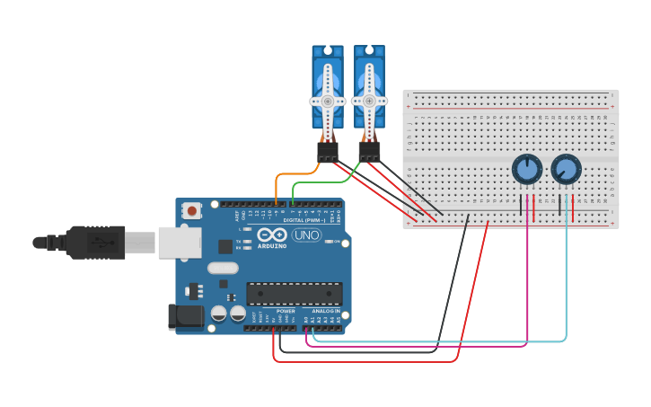

# Session 07: Processing → Arduino

Last session we sent data from the Arduino to Processing. Today we go the other direction: Processing sends data to the Arduino. We'll use mouseX and mouseY to control the 2-DOF robot arms you built in Session 05. At the end of class, everyone will share what they're thinking about for their final projects.

## Agenda

+ Processing → Arduino: controlling servos from the screen
+ Mouse-controlled robot arm
+ Final project brainstorm and share

---

## Part 1: Processing → Arduino (Mouse Controls Robot Arm)

In Session 05 you built a robot arm with two servos and two potentiometers. Today we swap out the potentiometers for your mouse. mouseX controls the base servo, mouseY controls the arm servo.

### The Plan

```
[ mouseX ] → map(0–180) ─┐
                          ├→ myPort.write(baseAngle, armAngle) → USB → Arduino → Servo.write()
[ mouseY ] → map(0–180) ─┘
```

### The Arduino Code

The Arduino waits for two bytes to arrive on the serial port: the first is the base angle, the second is the arm angle.

#### Circuit

Same robot arm circuit from Session 05. You only need the two servos wired up today — the potentiometers can stay connected but we won't be reading them.

1.  Servo 1 (Base): Signal → Pin 7, Red → 5V, Brown → GND
2.  Servo 2 (Arm): Signal → Pin 9, Red → 5V, Brown → GND

<p>
  
  <br>
  <em><a href="https://www.tinkercad.com/things/3q7nDz11QsR-2-potentiometer-2-servo">Tinkercad Circuit</a></em>
</p>

#### Arduino Code

```cpp
#include <Servo.h>

Servo baseServo;
Servo armServo;

void setup() {
  baseServo.attach(7);
  armServo.attach(9);
  Serial.begin(9600);
}

void loop() {
  // Wait until we have at least 2 bytes available
  if (Serial.available() >= 2) {
    int baseAngle = Serial.read();
    int armAngle = Serial.read();

    baseServo.write(baseAngle);
    armServo.write(armAngle);
  }
}
```

### The Processing Code

Processing maps the mouse position to two servo angles and sends them as two bytes each frame.

```java
import processing.serial.*;

// A variable to hold our serial connection to the Arduino.
Serial port;

void setup() {
  // Create a 600x600 pixel window.
  size(600, 600);

  // Print available serial ports to the console so you can find your Arduino.
  printArray(Serial.list());

  // Open the serial port. Change the [3] to match your Arduino's
  // position in the list printed above.
  port = new Serial(this, Serial.list()[3], 9600);
}

void draw() {
  // Redraw the background each frame.
  background(30);

  // mouseX is a built-in variable that holds the current horizontal
  // position of the mouse. mouseY is the vertical position.
  // We map each one from the window size (0 to 600) to a servo angle (0 to 180).
  int baseAngle = (int) map(mouseX, 0, width, 0, 180);
  int armAngle = (int) map(mouseY, 0, height, 0, 180);

  // constrain() clamps the value so it never goes below 0 or above 180,
  // even if the mouse moves outside the window.
  baseAngle = constrain(baseAngle, 0, 180);
  armAngle = constrain(armAngle, 0, 180);

  // Send both angles to the Arduino as raw bytes.
  // port.write() sends a single byte (a number 0–255).
  // The Arduino reads them in the same order: base first, arm second.
  port.write(baseAngle);
  port.write(armAngle);

  // --- Visual feedback on screen ---

  // Draw a crosshair at the mouse position.
  stroke(255, 150, 0);  // Orange lines
  strokeWeight(2);
  line(mouseX, 0, mouseX, height);  // Vertical line
  line(0, mouseY, width, mouseY);   // Horizontal line

  // Display the current angles as text in the top-left corner.
  fill(255);       // White text
  noStroke();
  textSize(16);
  text("Base: " + baseAngle + "°", 10, 30);
  text("Arm: " + armAngle + "°", 10, 55);
}
```

### Running It

1.  Upload the Arduino code.
2.  Close the Serial Monitor.
3.  Run the Processing sketch.
4.  Move your mouse around the window. The robot arm should follow: left/right controls the base, up/down controls the arm.

---

## Part 2: Final Project Brainstorm

Take a few minutes to think about what you'd like to build for your final project. It can use anything we've covered so far: LEDs, buttons, sensors, sound, motors, serial communication, Processing, or anything else you want to learn. It doesn't have to be fully formed yet, just a direction.

We'll go around the room and everyone will share:

- What are you thinking about building?
- What parts of the course are you most excited to use?
- Is there anything you'd need to learn that we haven't covered yet?

This is informal. Half-baked ideas are welcome. The point is to start thinking out loud so we can help each other figure things out.
