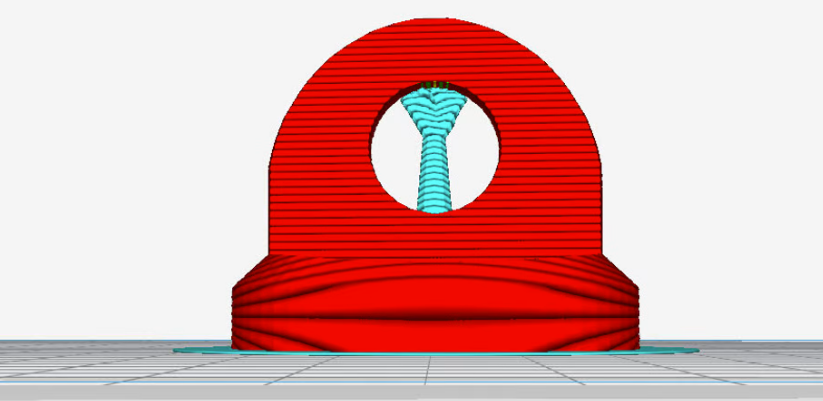
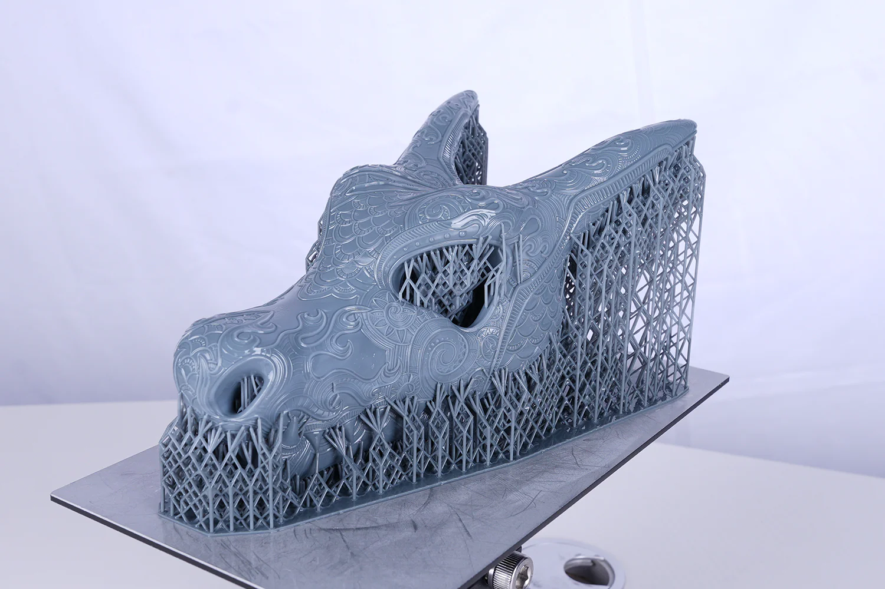
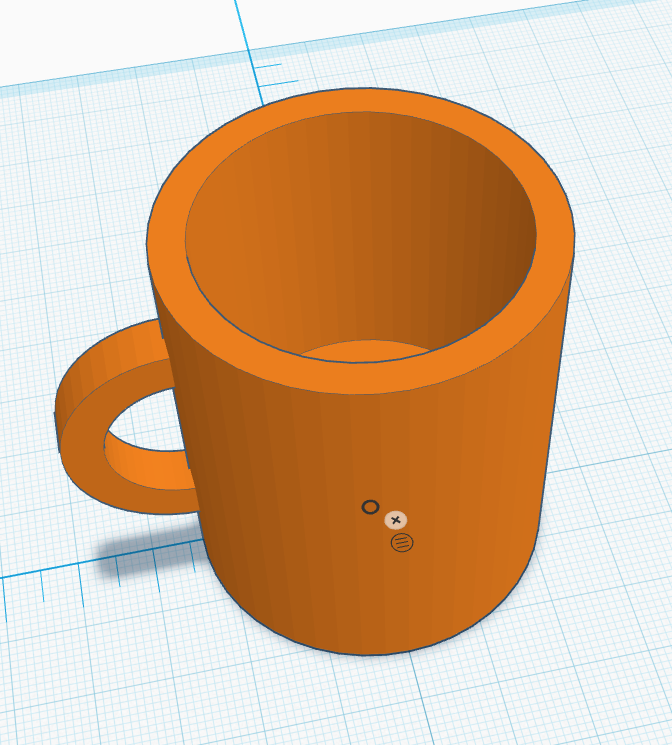
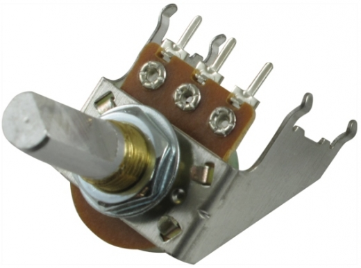
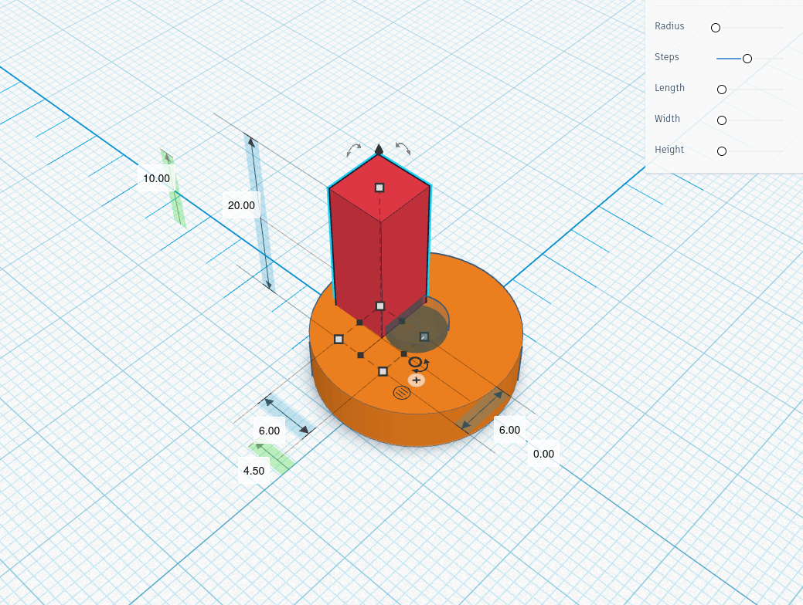

# Session 08: Designing for 3D Printing with TinkerCAD

Today we will talk about use cases for 3d printing alongside physical computing projects. In particular we will design custom extensions for potentiometers so that they are more easily adjustable and visually customizable. We will do this using the minimal but effective free online tool [TinkerCAD](https://www.tinkercad.com).

## Show and Tell

- A stepper motor filament spool - a real printed part doing real mechanical work
- A project box with a printed potentiometer knob.

Hold them. Look at the layer lines. Notice the D-shaped hole in the knob. That's the whole lesson in one object.

## What Is 3D Printing?

A 3D printer is essentially a very precise hot glue gun on a robot arm. It melts plastic filament (usually PLA) and deposits it layer by layer, building up a shape from the bottom. The process is called **FDM** - Fused Deposition Modeling.

### Printer Hardware & Setup

Before you start slicing your designs, please refer to the [3D Printer Setup Guide](../3d_printer_setup.md) for detailed instructions on using the Prusa i3 mk3 and Ender-3 printers available in the lab. It includes:
- **Download link** for PrusaSlicer.
- **Detailed setup** for each printer.
- **File naming convention** (G-code files for different printers are incompatible!).

Key things to internalize early:

| Fact | Why it matters |
|---|---|
| Parts are built in layers (~0.2mm each) | Horizontal holes print cleanly; vertical holes need supports |
| Overhangs past ~45° need supports | Design with this in mind or you'll print a mess |
| Print time is real | A small knob: ~20 min. A full enclosure: hours. |
| Tolerances are loose (~0.2-0.4mm) | Holes need to be slightly larger than the shaft they'll receive |

  
   
  <em>Supports holding up an otherwise open hole.</em>

  
   
  <em>Supports holding up a complex print.</em>

## Before we begin - Start print

Because 3d printing takes time, we will work backwards today: I will first start a print so that we can all see how it works before we begin modeling. (Sorry for the noise!)

## TinkerCAD Interface

TinkerCAD runs in the browser at [tinkercad.com](https://www.tinkercad.com). Create a free account, click Create → 3D Design.

### The Three Panels

- **Left**: your shape library (Basic Shapes, plus community imports)
- **Center**: the workplane - your canvas
- **Right**: nothing much, but the Inspector pops up top-right when you select something

### Controls - Learn These Before Anything Else

| Action | How |
|---|---|
| **Orbit** (rotate view) | Right-click + drag |
| **Pan** | Middle-click + drag (or hold Shift + right-click drag) |
| **Zoom** | Scroll wheel |
| **Frame selected** | **F** |
| **Drop to workplane** | **D** - no icon for this, you must use the key. Use it constantly. |
| **Duplicate in place** | **Ctrl+D** |
| **Group** | **Ctrl+G** |
| **Ungroup** | **Ctrl+Shift+G** |
| **Undo** | **Ctrl+Z** |
| **Nudge** | Arrow keys (1mm), Shift+Arrow (10mm) |
| **Home view** | **Home** key |
| **Scale** | Drag white corner handles (hold **Shift** to scale uniformly) |
| **Scale from center** | Hold **Alt** while scaling |

> **The D key is the most-forgotten thing in TinkerCAD.** When you drag a shape onto the workplane it often floats in mid-air. Press **D** and it snaps down to the surface. Do this every time you place a shape.

## Basic Shapes

Shapes live in the left panel. Drag any shape onto the workplane, then press **D** to drop it to the surface. Every shape can be resized, repositioned, and toggled between solid and hole.

| Shape | What it is |
|---|---|
| **Box** | A rectangular solid — the workhorse. Use it for bodies, tabs, cutouts, and flat features. All six faces are flat, so it prints cleanly in any orientation. |
| **Cylinder** | A round solid with flat top and bottom. Use it for shaft holes, rounded posts, and any feature with circular cross-section. Resize the two radius handles independently to make an oval. |
| **Scribble** | A freehand draw tool. Sketch a 2D outline and TinkerCAD extrudes it into a solid. Useful for organic shapes, logos, or anything that doesn't fit a primitive. Results can be unpredictable — keep outlines simple and avoid self-intersecting lines. |

### Positive vs. Negative

Every shape in TinkerCAD is either a **solid** or a **hole** — this is the core concept behind all modeling here.

| Type | What it does |
|---|---|
| **Positive shape (solid)** | The default. Adds material. Shown in color. When grouped, it becomes part of the finished object. |
| **Negative shape (hole)** | Subtracts material. Toggle any shape to a hole in the Inspector — it turns translucent red/grey. On its own it does nothing. Group it with a solid and TinkerCAD punches it through. |

> A hole shape must be **grouped** with a solid before it cuts anything. `Ctrl+G` is what executes the boolean operation — until then, the hole is just floating geometry.

## Project 1: Coffee Cup (~25 minutes)

A simple mug: a hollow cylinder body with a handle. You'll learn: placing and sizing shapes, making a cavity with a hole, and the trickier skill of positioning the handle precisely using the ruler and midpoint mode.

  
   
  <em>A simple mug with a handle, as modeled in TinkerCAD.</em>

### What You're Building

An outer cylinder for the body, a shorter cylinder hole for the cavity, and a torus for the handle — cut in half so the flat face sits flush against the cup wall. The handle alignment is where most people get stuck, and it's the thing worth learning.

### Step-by-Step

**1. The outer body**
- Drag a **Cylinder** onto the workplane. Press **D**.
- Set: **Diameter 60mm, Height 70mm**.

**2. The inner cavity**
- Drag another **Cylinder** onto the workplane. Press **D**.
- Set: **Diameter 52mm, Height 65mm** (narrower and shorter than the body — this leaves a 4mm wall and a solid base).
- Toggle it to **Hole** in the Inspector.
- Use the **Align tool** (**L** with both selected) to center it on both X and Y axes.
- Group both (**Ctrl+G**). The cup is now hollow.

**3. The handle**
- Drag a **Torus** onto the workplane. Press **D**.
- Set: **Outer diameter ~30mm, Tube diameter ~8mm**. This is approximate — adjust to taste.
- The torus is a full ring. You need to cut it in half so the flat face can sit against the cup wall. Drag a **Box** onto the workplane, size it larger than half the torus (e.g. **W 40mm, L 40mm, H 40mm**), toggle it to **Hole**, and position it to slice off exactly half the ring.

> **Getting the cut centered**: This is where precision matters. Click the box hole, then press **E** to activate the **Ruler**. Click to anchor it at the midpoint of the torus. With the ruler placed, the position text boxes in the Inspector now show coordinates relative to that anchor point. Set the box position so its edge sits exactly at X=0 (the torus center). This is midpoint mode — you're measuring from the center of the object, not its corner.

- Select the torus and box hole, **Ctrl+G**. You now have a half-torus.

**4. Attach the handle**
- With the half-torus selected, look at the Inspector. The flat face needs to sit flush against the cup's outer wall.
- The cup outer radius is **30mm** (half of 60mm). So the flat face of the handle needs to be at X = 30mm from the cup center.
- Click the half-torus, then click into the **X position text box** in the Inspector and type the value directly. Don't nudge — type it. This is the fastest way to land on an exact position.
- Use **Align** (**L**) to center the handle vertically on the cup (align on the Z axis to match midpoints).

**5. Final group**
- Select everything, **Ctrl+G**.
- Orbit underneath — check the base is solid and the cavity doesn't poke through the bottom.
- **Export → .STL**.

### New Concepts Introduced Here

| Concept | What it does |
|---|---|
| **Ruler (E key)** | Places a measurement anchor on the workplane — position text boxes now show distance from that point |
| **Midpoint mode** | Snap the ruler to the center of a shape, not its corner, so your coordinates describe the object's center |
| **Position text boxes** | Click directly into the X/Y/Z fields in the Inspector and type a number — much faster than nudging for exact placement |
| **Torus** | A ring primitive — useful for handles, gaskets, and any circular loop shape |

> **Why type the position instead of nudging?** Arrow keys move 1mm per tap. Getting from an arbitrary position to exactly 30.00mm by nudging means ~30 keystrokes and a lot of squinting. Clicking the text box and typing `30` takes one second. Use the text boxes any time you have a known target dimension.

## Before Project 2: Printer Settings

Before starting, set your grid to match the Prusa MK3 build plate. Look at the **bottom-right corner** of the screen and click the **Settings button** (gear icon).

Set:
- **Units**: Millimeters
- **Width**: 250
- **Length**: 210

This ensures your design won't exceed the physical print area.

## Project 2: Custom Potentiometer Knob

This is the real one. You've been twisting a bare metal shaft for weeks. Now you'll design a knob that fits it perfectly, looks how you want it to look, and has your name or a marker line on top.

### Know Your Hardware First

  
   
  <em>A pot with a D-shaped shaft.</em>

The potentiometers used in this course (standard 10kΩ panel-mount) have a **D-shaped shaft**:
- **Shaft diameter**: 6mm
- **Flat-to-opposite-side distance**: 4.5mm (the "D" cuts 1.5mm off one side)
- **Shaft length**: typically 15–20mm from the mounting surface

This geometry is critical. A plain round 6mm hole will spin freely on the shaft — the knob won't transmit rotation at all. You need to model the D-shape exactly.

Also account for **print tolerance**: add **0.3mm** to the hole diameter so it doesn't print too tight to fit. Model the round hole as **6.3mm**, not 6mm. The exact tolerance depends on your specific printer, so some trial and error is normal.

### How to Set Exact Dimensions on a Shape

TinkerCAD doesn't have a single dimension input. Each axis has its own handle:

- **Diameter (X and Y)**: Click once to select the shape. Click any **white square handle** at the corners of the base. Two blue text boxes appear on the grid — click into them and type your value.
- **Height (Z)**: Click the **white square handle** at the very top-center of the shape. A vertical blue text box appears — type your value there.

All dimensions are in **millimeters** by default.

### Step-by-Step

  
   
  <em>example screenshot of constructing the pot knob with a d-shaft cut-out. <a href="https://www.tinkercad.com/things/lHA0Xg6X4mE/edit?returnTo=%2Fdashboard&sharecode=B5KXZdTKHjlFH4aP8U_rgPzYfwBjJEAy9vfFU8oQ--Y">Link to finished design</a></em>

**1. The outer body (shape 1)**
- Drag a **Cylinder** onto the workplane. Press **D**.
- Set: **Diameter 18mm, Height 15mm** using the corner handles described above.
- This is your grip. Larger diameter = easier to turn; smaller = sleeker profile. Leave it as a solid for now.

**2. The shaft hole cylinder (shape 2)**
- Drag another **Cylinder** onto the workplane. Press **D**.
- Set: **Diameter 6.3mm, Height 20mm** (taller than the body so it punches all the way through when grouped).
- **Do not toggle this to a hole yet.** Leave it as a solid for now.
- Set it aside — you'll come back to it after step 3.

**3. The D-flat cutout (shape 3)**
- Drag a **Box** onto the workplane. Press **D**.
- Set: **W 6mm, L 6mm, H 20mm**.

> **Why 6×6?** TinkerCAD positions shapes from their corner, not their center. A 6×6 box gives you a clean edge to work with. You'll move this box using the ruler so one face lands at exactly 4.5mm from the shaft center — matching the flat-to-opposite-side distance on the real shaft.

- With the box selected, press **E** to place the **Ruler**. Click to anchor it at the center of shape 2 (the shaft cylinder).
- Now the Inspector's position fields show distance from that anchor. Type **X = 4.5mm** to move the box so its near face sits exactly at the flat of the D.

**4. Group in the correct order**

The order here matters. Do it wrong and the flat cut won't land correctly.

- **Toggle shape 3 (the box) to Hole.**
- Select **shape 3 and shape 2 only** → **Ctrl+G**. This cuts the D-flat into the shaft cylinder. You now have a D-shaped solid object.
- **Toggle that group to Hole.**
- Select **that group and shape 1** → **Ctrl+G**. The D-hole is now punched through the outer body.

> **Why this order?** If you toggle shape 2 to a hole before grouping it with shape 3, TinkerCAD subtracts both shapes from the body at once and the flat cut loses its reference position. Always cut the flat into the round first, then subtract the whole D from the body as a single operation.

**5. Make it yours**

**Optional: Adding Grip Ridges**

- Drag a **Box** onto the workplane. Set: **W 4mm, L 21mm, H 15mm** (the extra length makes it protrude past the 18mm body diameter).
- Center it on the knob using **Align** (**L**).
- With the box selected, **Ctrl+D** to duplicate, then rotate it **22.5°** using the rotation handle (or type it into the angle field in the Inspector).
- **Ctrl+D** again — TinkerCAD remembers the last transform and applies the same 22.5° rotation automatically. Repeat until you have a full circle (8 duplicates total).
- Select everything, **Ctrl+G**.

> The 22.5° increment is what gives you exactly 8 evenly-spaced ridges (360° ÷ 8 = 45°, but since the box is symmetric you only need to rotate half that to get the next ridge). TinkerCAD's transform memory makes this fast: after the first manual rotation every subsequent duplicate lands in the right place automatically.

| Customization | How in TinkerCAD |
|---|---|
| Pointer line on top | Add a thin flat Box (1mm tall) across the top surface, keep it solid, group |
| Knurled grip | Add small cylinders around the outside edge as solid shapes, group |
| Your initials on top | Use the **Text** shape (in the shape library), extrude 1–2mm above the surface |
| Tapered body | Use a **Cone** or **Paraboloid** instead of a cylinder for the body |
| Color | Doesn't affect printing, but helps visualization in TinkerCAD |

**6. Check before exporting**
- Orbit all the way under the knob. Is the D-hole visible from the bottom? Good.
- Select the whole group — Inspector should show height as **15mm**.
- **Export → .STL**.

### Test Fit (After Printing)
- Too tight: increase the hole cylinder diameter by 0.2mm, re-export, reprint.
- Spins freely: the D-flat cutout didn't go deep enough — move it 0.2mm further in and reprint.

This iteration is normal. It's not failure, it's calibration.

---

## Printing Tips

| Tip | Detail |
|---|---|
| **Layer height** | 0.2mm is fine for everything here. 0.1mm is smoother but 2× slower. |
| **Infill** | 15–20% for the cup. 40%+ for the knob (it takes torque). |
| **No supports needed** | Both projects are designed to avoid overhangs. |
| **Orientation matters** | Print the knob with the top face *down* on the bed — the D-hole will be cleaner. |
| **First layer adhesion** | If it's not sticking: clean the bed with IPA, slow down the first layer, or add a brim. |

---

## Key Concepts Summary

| Concept | What It Does |
|---|---|
| **Hole toggle** | Turns any shape into a boolean cutter |
| **Ctrl+G (Group)** | Executes all cuts and merges, bakes the geometry |
| **D key** | Drops shape to workplane — use obsessively |
| **Align tool (L)** | Centers shapes relative to each other |
| **Ruler (E key)** | Anchors the coordinate system to a point you choose |
| **Midpoint mode** | Measures from an object's center, not its corner |
| **Tolerance** | Add 0.2–0.4mm to any dimension that fits over hardware |
| **.STL export** | The universal format slicer software (Cura, PrusaSlicer) reads |

## More Project Ideas

| Project | What You'd Learn |
|---|---|
| Arduino Uno enclosure | Shell modeling, snap fits, port cutouts |
| Servo horn extension arm | Screw hole tolerances, lever geometry |
| Breadboard feet | Thin flat parts, press-fit pegs |
| LED diffuser cap | Thin walls, translucent filament |

Three worth linking, each serving a different need:

**Official / interactive**
- **Let's Learn TinkerCAD** — `https://www.tinkercad.com/learn/overview/O8XV0X1IRXTXGIH`
TinkerCAD's own built-in tutorial sequence. Guides you through the 3D design process with hands-on interactive lessons directly in the app.

**Quick written reference**
- **All3DP: TinkerCAD Tutorial — 5 Simple Steps to Success** — `https://all3dp.com/2/tinkercad-tutorial-easy-beginners/`
A clean beginner walkthrough, regularly updated (last revised 2024).

**Video + structured course**
- **Learning TinkerCAD on LinkedIn Learning** (Kacie Hultgren) — searchable via LinkedIn Learning. An 11-section course covering fundamentals through Codeblocks and Circuits, with a completion certificate. Good for students who want to go deeper after the session.

## Further Reading

- [Let's Learn TinkerCAD](https://www.tinkercad.com/learn/overview/O8XV0X1IRXTXGIH) — official interactive tutorial, built into the app
- [All3DP: TinkerCAD in 5 Steps](https://all3dp.com/2/tinkercad-tutorial-easy-beginners/) — clean written beginner reference
- [Learning TinkerCAD (LinkedIn Learning)](https://www.linkedin.com/learning/search?keywords=learning+tinkercad) — full video course by Kacie Hultgren, covers Codeblocks and Circuits